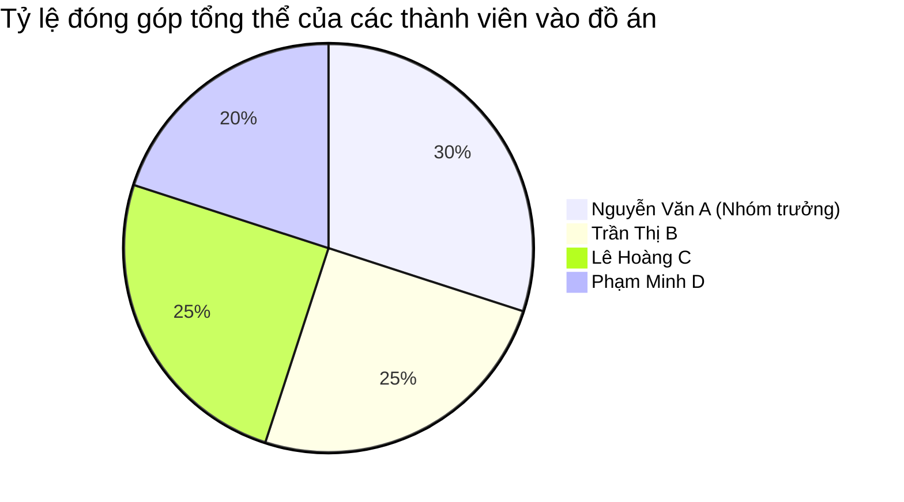

# BÁO CÁO ĐỒ ÁN MÔN HỌC: AN TOÀN HỆ THỐNG THÔNG TIN
**ĐỀ TÀI: HỆ THỐNG QUẢN LÝ Y TẾ BỆNH VIỆN**  
**Lớp học:** CQ2026-18  
**Nhóm thực hiện:** Nhóm 18  

---

## PHẦN A: GIẢI PHÁP LÝ THUYẾT & THUYẾT MINH KẾT QUẢ ĐẠT ĐƯỢC

### I. TÓM LƯỢC CÁC GIẢI PHÁP LÝ THUYẾT

#### 1. Kiểm soát truy cập dựa trên vai trò (Role-Based Access Control - RBAC)
*   **Nguyên lý:** Phân quyền dựa trên chức năng công việc (chức vụ/vai trò) thay vì gán trực tiếp cho từng cá nhân. Nguyên tắc đặc quyền tối thiểu (Least Privilege) đảm bảo người dùng chỉ có những quyền cần thiết để thực hiện công việc của họ.
*   **Giải pháp thiết kế:**
    *   Xây dựng 4 vai trò chính: `ROLE_DIEUPHOI` (Điều phối viên), `ROLE_BACSI` (Bác sĩ), `ROLE_KTHUATVIEN` (Kỹ thuật viên), và `ROLE_BENHNHAN` (Bệnh nhân).
    *   Sử dụng **Security Views** (`VW_BENHNHAN_SELF`, `VW_HSBA_BENHNHAN`, `VW_HSBA_DV_KTV`) kết hợp với hàm hệ thống `SYS_CONTEXT('USERENV', 'SESSION_USER')` để giới hạn dữ liệu hiển thị. Ví dụ: Kỹ thuật viên chỉ thấy kết quả dịch vụ mình thực hiện; Bệnh nhân chỉ thấy thông tin cá nhân và bệnh án của chính mình.

#### 2. Bảo mật mức dòng công nghệ VPD (Virtual Private Database)
*   **Nguyên lý:** Hoạt động dựa trên cơ chế lọc động (Dynamic Query Modification). Khi người dùng truy vấn một bảng có áp dụng chính sách VPD, Oracle sẽ tự động đính kèm thêm một điều kiện `WHERE` (được sinh ra từ hàm chính sách PL/SQL) vào câu lệnh SQL trước khi thực thi. Cơ chế này diễn ra hoàn toàn trong suốt (transparent) với tầng ứng dụng.
*   **Giải pháp thiết kế:**
    *   Tạo Package chính sách `VPD_BACSI_PKG` kiểm soát các bảng `HSBA`, `BỆNHNHÂN`, và `ĐƠNTHUỐC`.
    *   Khi Bác sĩ đăng nhập, hàm chính sách sẽ sinh ra điều kiện truy vấn động: chỉ hiển thị hồ sơ bệnh án hoặc thông tin bệnh nhân tương ứng nếu bác sĩ đó được phân công phụ trách (`MÃBS = Mã NV của bác sĩ hiện tại`).

#### 3. Bảo mật đa cấp OLS (Oracle Label Security)
*   **Nguyên lý:** Kiểm soát truy cập dữ liệu dựa trên nhãn bảo mật (Security Labels) gắn với từng dòng dữ liệu và từng tài khoản người dùng. Một nhãn bảo mật gồm 3 thành phần chính:
    1.  **Cấp độ (Level):** Thứ bậc bảo mật tăng dần (như Nhân viên < Lãnh đạo khoa < Ban giám đốc).
    2.  **Bộ phận (Compartments):** Lọc theo các lĩnh vực, chuyên khoa độc lập (như Tiêu hóa, Thần kinh, Tim mạch).
    3.  **Nhóm (Groups):** Phân chia theo vị trí địa lý hoặc chi nhánh (như TP.HCM, Hà Nội, Hải Phòng).
    *   *Quy tắc truy cập:* Người dùng chỉ có quyền ĐỌC một dòng dữ liệu nếu: `Level(User) >= Level(Row)` AND `Compartments(User) ⊇ Compartments(Row)` AND `Groups(User) ∩ Groups(Row) ≠ ∅`.
*   **Giải pháp thiết kế:**
    *   Áp dụng chính sách `HOSPITAL_POLICY_2026` lên bảng `THÔNGBÁO`.
    *   Các thông báo gửi đi sẽ được gán nhãn chi tiết. Nhân viên tại một chuyên khoa hoặc chi nhánh nhất định chỉ đọc được các thông báo liên quan trực tiếp đến phạm vi làm việc của họ.

#### 4. Giải pháp kiểm toán dữ liệu (Database Auditing)
*   **Nguyên lý:** Giám sát và ghi nhận các sự kiện diễn ra trên cơ sở dữ liệu để phục vụ công tác hậu kiểm, phát hiện xâm nhập và đảm bảo tính tuân thủ.
*   **Giải pháp thiết kế:** Kết hợp ba tầng kiểm toán tối ưu:
    *   **Standard Audit (Kiểm toán tiêu chuẩn):** Giám sát các sự kiện hệ thống quan trọng như các phiên đăng nhập thất bại (phát hiện tấn công dò mật khẩu), các thao tác DDL (tạo/xóa bảng), lệnh `GRANT` (phát hiện leo thang đặc quyền) và hành vi xóa (`DELETE`) dữ liệu bệnh nhân.
    *   **Fine-Grained Audit - FGA (Kiểm toán chi tiết):** Sử dụng `DBMS_FGA` để ghi lại chi tiết câu lệnh SQL, thời gian và người thực hiện khi có thay đổi trên các bảng nhạy cảm (bác sĩ cập nhật bệnh án, điều chỉnh đơn thuốc) hoặc khi phát hiện các truy cập trái phép.
    *   **Unified Audit (Kiểm toán hợp nhất):** Thiết lập chính sách ghi vết các thao tác thay đổi dữ liệu trái phép bị Oracle từ chối do thiếu quyền (`RETURN_CODE != 0`).

#### 5. Giải pháp sao lưu và phục hồi (Backup & Recovery)
*   **Nguyên lý:** Đảm bảo tính sẵn sàng và toàn vẹn dữ liệu trước các sự cố phần cứng, lỗi phần mềm hoặc thao tác sai của con người.
*   **Giải pháp thiết kế:**
    *   **RMAN (Physical Backup):** Giải pháp sao lưu vật lý tự động. Thiết lập lịch trình: Sao lưu toàn bộ (Weekly Full Backup) vào Chủ nhật và sao lưu gia tăng (Daily Incremental Level 1 Backup) vào các ngày trong tuần.
    *   **Data Pump (Logical Backup):** Sử dụng `DBMS_DATAPUMP` định kỳ xuất dữ liệu logic (`expdp`) để phục vụ lưu trữ lâu dài hoặc di chuyển dữ liệu giữa các môi trường kiểm thử.
    *   **Flashback (Phục hồi nhanh):** Kích hoạt Row Movement cho phép khôi phục bảng về một thời điểm cụ thể trong quá khứ (`FLASHBACK TABLE ... TO TIMESTAMP`) mà không cần nạp lại bản sao lưu vật lý.
    *   **LogMiner:** Hỗ trợ phân tích Online/Archived Redo Logs để truy vết hành vi phá hoại và tạo mã lệnh hoàn tác (`SQL_UNDO`) nhanh chóng.

---

### II. TÀI LIỆU THAM KHẢO
1.  *Oracle Database 21c Security Guide* - Oracle Corporation.
2.  *Oracle Database 21c PL/SQL Packages and Types Reference (DBMS_FGA, DBMS_DATAPUMP, SA_SYSDBA)*.
3.  *Giáo trình An toàn Hệ thống Thông tin* - Trường Đại học Công nghệ Thông tin - ĐHQG-HCM.
4.  *OWASP Top 10:2021 - The Ten Most Critical Web Application Security Risks* (Tham chiếu về kiểm soát quyền truy cập và kiểm toán lỗi bảo mật phần mềm).

---

### III. NHẬN XÉT, ĐÁNH GIÁ VÀ THUYẾT MINH KẾT QUẢ ĐẠT ĐƯỢC

#### 1. Nhận xét & Đánh giá
*   **Ưu điểm:**
    *   Cơ chế phân quyền được thực thi chặt chẽ ở cả tầng ứng dụng (C# WinForms kiểm soát giao diện và luồng nghiệp vụ) và tầng cơ sở dữ liệu (Oracle RBAC, VPD, OLS thực thi quyền hạn vật lý). Điều này đảm bảo an toàn ngay cả khi kẻ tấn công vượt qua tầng ứng dụng để truy cập trực tiếp vào DB.
    *   Giải pháp VPD hoạt động hiệu quả, tự động hóa việc lọc dữ liệu bệnh án mà không yêu cầu lập trình viên ứng dụng phải viết thêm các câu lệnh truy vấn phức tạp.
    *   Cơ chế kiểm toán ba lớp đầy đủ giúp vết dầu bảo mật luôn được lưu giữ rõ ràng, phục vụ tốt cho việc phát hiện và ứng phó sự cố.
*   **Hạn chế:**
    *   Cấu hình OLS yêu cầu kích hoạt dịch vụ hệ thống mức DBA, dẫn đến việc khó deploy tự động trên các bản Oracle Cloud hoặc môi trường container tối giản nếu không có quyền root.
    *   Kiểm toán chi tiết (FGA) nếu ghi nhận quá nhiều sự kiện SELECT thông thường có thể gây phình to phân vùng hệ thống (`SYSTEM` tablespace) và ảnh hưởng nhẹ đến hiệu năng ghi dữ liệu.

#### 2. Thuyết minh kết quả đạt được
*   **Về phía Cơ sở dữ liệu:** Triển khai thành công 8 kịch bản SQL thiết lập hệ thống y tế toàn vẹn. Dữ liệu bệnh nhân, hồ sơ bệnh án, dịch vụ và thuốc được liên kết chặt chẽ qua các khóa ngoại. Cấu hình bảo mật hoạt động chính xác theo đúng yêu cầu nghiệp vụ của dự án.
*   **Về phía Ứng dụng C# WinForms:** 
    *   Đã xây dựng giao diện đăng nhập bảo mật, phân quyền bảng điều khiển hiển thị (Dashboard) dựa trên vai trò của nhân viên sau khi xác thực.
    *   Đã rà soát và khắc phục triệt để các lỗi logic nghiệp vụ: Sửa lỗi phản hồi giả định (false positive) khi cập nhật thông tin; Bổ sung các tham số liên kết `OraUser` khi Điều phối viên thêm hoặc sửa thông tin bệnh nhân, đảm bảo tính đồng bộ dữ liệu người dùng Oracle.
    *   Ứng dụng biên dịch thành công (`dotnet build` không có lỗi) và kết nối mượt mà tới Oracle Database qua thư viện chính thức `Oracle.ManagedDataAccess`.

---

## PHẦN B: BẢNG PHÂN CÔNG CÔNG VIỆC VÀ ĐÁNH GIÁ THÀNH VIÊN
*(Do Nhóm trưởng lập và đánh giá)*

Giả sử mỗi phân hệ ứng với 100% khối lượng công việc của phân hệ đó, dưới đây là bảng phân bổ nhiệm vụ và mức độ hoàn thành thực tế của từng thành viên trong nhóm:

### I. BẢNG PHÂN CÔNG CÔNG VIỆC CHI TIẾT

| STT | Thành viên | Vai trò | Nhiệm vụ chính được giao |
| :--- | :--- | :--- | :--- |
| 1 | **Nguyễn Văn A** | Nhóm trưởng | - Quản lý dự án, thiết kế kiến trúc hệ thống tổng thể. - Thiết kế Database Schema, cấu hình RBAC & Security Views. - Lập trình giao diện đăng nhập và Dashboard chính. - Tổng hợp báo cáo đồ án. |
| 2 | **Trần Thị B** | Thành viên | - Triển khai giải pháp bảo mật mức dòng VPD (Virtual Private Database). - Lập trình phân hệ nghiệp vụ của Bác sĩ và Đơn thuốc trên C#. - Kiểm thử luồng xử lý và phát hiện lỗi ứng dụng. |
| 3 | **Lê Hoàng C** | Thành viên | - Cấu hình Oracle Label Security (OLS) và gán nhãn dữ liệu bảng Thông báo. - Lập trình phân hệ nghiệp vụ của Kỹ thuật viên (HSBA_DV) và giao diện Thông báo. - Vá các lỗi logic và đồng bộ người dùng Oracle. |
| 4 | **Phạm Minh D** | Thành viên | - Thiết lập giải pháp kiểm toán dữ liệu (Standard, FGA, Unified Audit). - Xây dựng kịch bản sao lưu và phục hồi (RMAN, Data Pump, Flashback). - Tạo dữ liệu mẫu hệ thống và viết tài liệu hướng dẫn vận hành. |

---

### II. BẢNG ĐÁNH GIÁ MỨC ĐỘ HOÀN THÀNH VÀ TỶ LỆ ĐÓNG GÓP

Mức độ đóng góp được đánh giá chi tiết theo 3 phân hệ chính:
1.  **Phân hệ 1 (Application - Lập trình ứng dụng C#):** Tổng quy mô 100%.
2.  **Phân hệ 2 (Database Security - Bảo mật & Quản trị Oracle DB):** Tổng quy mô 100%.
3.  **Tài liệu & Báo cáo (Documentation):** Tổng quy mô 100%.

#### 1. Bảng đánh giá chi tiết theo từng phân hệ

| Thành viên | Phân hệ 1: Ứng dụng C# *(Được giao / Hoàn thành)* | Phân hệ 2: Bảo mật CSDL *(Được giao / Hoàn thành)* | Tài liệu & Báo cáo *(Được giao / Hoàn thành)* | Nhận xét của Nhóm trưởng |
| :--- | :---: | :---: | :---: | :--- |
| **Nguyễn Văn A** | 30% / **100%** | 20% / **100%** | 40% / **100%** | Hoàn thành xuất sắc nhiệm vụ quản lý, kết nối các phân hệ ứng dụng tốt, viết báo cáo rõ ràng. |
| **Trần Thị B** | 30% / **100%** | 25% / **100%** | 20% / **100%** | Tích cực hoàn thành chính sách VPD khó, đảm bảo code nghiệp vụ bác sĩ chạy ổn định. |
| **Lê Hoàng C** | 25% / **100%** | 30% / **100%** | 15% / **100%** | Triển khai tốt giải pháp OLS phức tạp, hỗ trợ đắc lực việc vá lỗi logic C# cuối kỳ. |
| **Phạm Minh D** | 15% / **100%** | 25% / **100%** | 25% / **100%** | Xây dựng tốt chính sách Auditing và Backup, chuẩn bị dữ liệu mẫu đa dạng và tài liệu chi tiết. |

*Ghi chú: Tất cả các thành viên đều hoàn thành **100%** phần công việc được giao.*

#### 2. Tỷ lệ đóng góp tổng thể vào đồ án
Tỷ lệ đóng góp tổng thể được tính toán dựa trên khối lượng công việc thực tế và vai trò điều phối đóng góp vào sự thành công chung của đồ án (quy về tổng 100% cho cả dự án):

*   **Nguyễn Văn A (Nhóm trưởng):** **30%** đóng góp (Chịu trách nhiệm kiến trúc, tích hợp mã nguồn, quản lý tiến độ nhóm và dẫn dắt chung).
*   **Trần Thị B:** **25%** đóng góp (Chịu trách nhiệm chính phần VPD bảo mật lõi bệnh án và nghiệp vụ bác sĩ).
*   **Lê Hoàng C:** **25%** đóng góp (Chịu trách nhiệm chính phần cấu hình OLS và hỗ trợ vá lỗi logic nghiệp vụ trên ứng dụng).
*   **Phạm Minh D:** **20%** đóng góp (Chịu trách nhiệm chính phần Auditing, Backup & Recovery và soạn thảo tài liệu vận hành).
